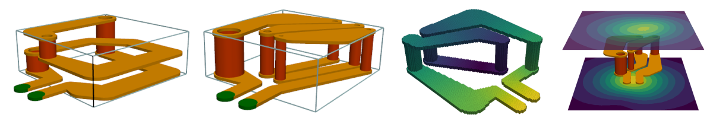
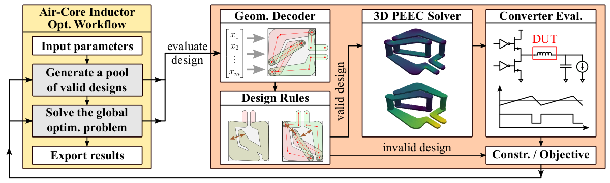

# PyFreeCoil - Free-Shape Optimization of Air-Core Inductors

## Summary

This repository contains the **source code** related to the following **paper**:
* **Free-Shape Optimization of VHF Air-Core Inductors using a Constraint-Aware Genetic Algorithm**
* **Thomas Guillod and Charles R. Sullivan**
* **https://doi.org/10.1109/APEC48143.2025.10977326**
* **IEEE APEC 2025**
* [**Paper** (IEEE copyright)](docs/paper.pdf)
* [**Slides** (CC BY-ND 4.0)](docs/slides.pdf)

**PyFreeCoil** features the following **characteristics**:
* **Free-shape optimization** of multi-layer air-core **inductors**
* Global optimization with a **constraint-aware genetic algorithm**
* Complete **design rule checker**
* Full **3D PEEC solver**

## Documentation

* [**Installation**](docs/INSTALL.md)
* [**Getting Started**](docs/HOWTO.md)
* [**Paper** (IEEE copyright)](docs/paper.pdf)
* [**Slides** (CC BY-ND 4.0)](docs/slides.pdf)

## Optimized Inductors

## Optimization Workflow

## Author

* Name: **Thomas Guillod**
* Affiliation: Dartmouth College
* Email: guillod@otvam.ch
* Website: https://otvam.ch

## Credits

PyFreeCoil was created at **Dartmouth College** by the research group of **Prof. Sullivan**:
* Dartmouth College, NH, USA: https://dartmouth.edu
* Dartmouth Engineering: https://engineering.dartmouth.edu
* NSF/PMIC: https://pmic.engineering.dartmouth.edu
* PyPEEC 3D Solver: https://pypeec.otvam.ch

## Copyright

(c) 2023-2024 / Thomas Guillod / Dartmouth College

This Source Code Form is subject to the terms of the Mozilla Public
License, v. 2.0. If a copy of the MPL was not distributed with this
file, You can obtain one at http://mozilla.org/MPL/2.0/.
